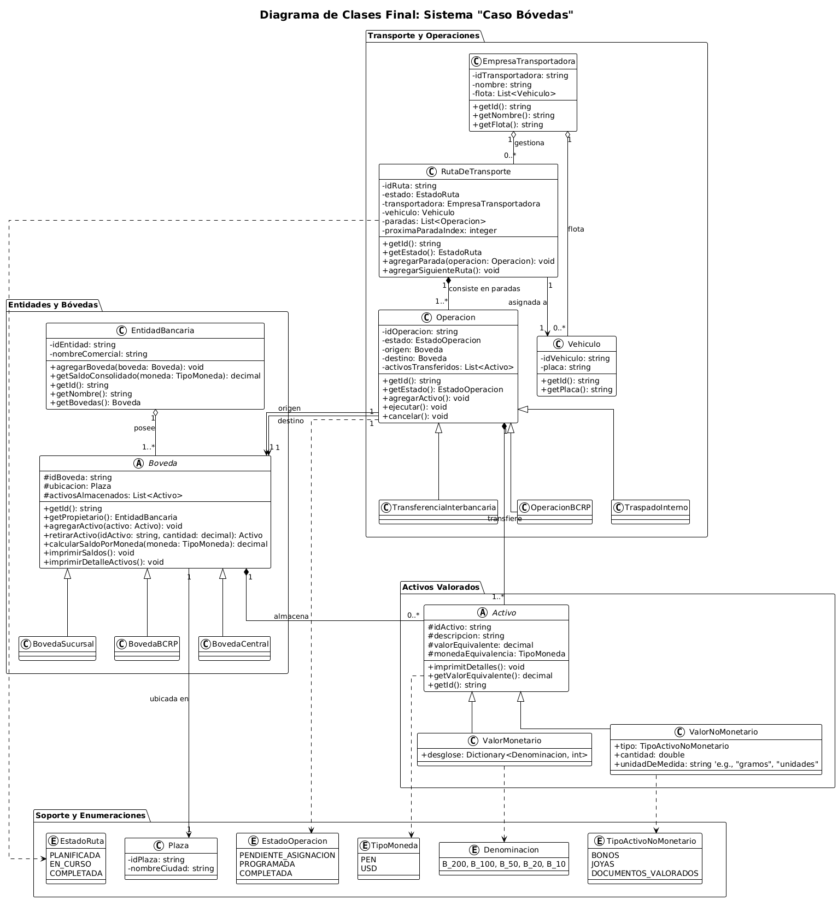
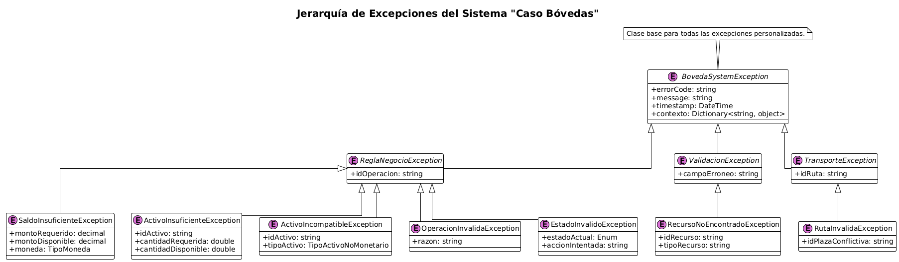

# <samp>Ejecución del Caso las Bóvedas</samp>
Primero, debe clocar este repositorio GitHub

> Podemos clocar con el protocolo HTTPS

```zsh
git clone https://github.com/JhonAQ/ProgSist-Test1-SistemaBCR.git
```        

Luego, debemos tener instalado `make`, como requerimiento para construir el 
proyecto. Una vez verificada su instalación, podemos proceder a compilar
nuestro proyecto.

> Ingresamos al directorio raíz del proyecto y contruimos con el 
> siguente comando

```zsh
make
```

Finalmente, ejecutamos el binario ubicacod en `/bin/gestor_bovedas`

> Ejecución del binario

```zsh
./bin/gestor_bovedas
```

# <samp>Diagrama UML de la lógica de negocio</samp>

El siguiente diagrama UML de clases nos muestra las relaciones hechas para 
implementar la funcionalidad que se desea.



# <samp>Diagrama UML de la Jerarquia de las excepciones</samp>

El proyecto usa las siguiente excepciones para manejar los casos de error


